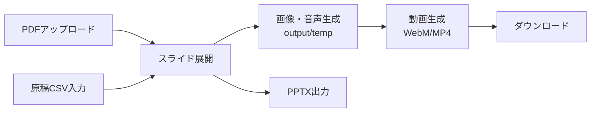

# Slide Voice Maker

PDFスライドと原稿CSVから、AI音声ナレーション付き動画（WebM/MP4）を自動生成するツールです。

**バージョン**: 1.0.0
**日付**: 2026-01-05
**リポジトリ**: https://github.com/J1921604/Slide-Voice-Maker

## 📦 機能概要



### 主要機能

| 機能                     | 説明                                                                      |
| ------------------------ | ------------------------------------------------------------------------- |
| **PDF入力**        | PDFファイルをアップロードしスライドとして展開（input/にファイル名で保存） |
| **原稿CSV入力**    | inputフォルダにCSVファイルを入力したファイル名で上書き保存                |
| **発音辞書**       | word,alias形式のCSVで特定単語の読み方をテキスト置換                       |
| **解像度選択**     | 720p/1080p/1440pから選択（画像解像度）                                    |
| **音声選択**       | Edge TTSで4種類の音声プリセットから選択（詳細は下記参照）                 |
| **再生速度**       | 0.5x〜2.0xで音声再生速度を調整                                            |
| **字幕ON/OFF**     | 動画に字幕を埋め込むかどうかを選択                                        |
| **画像・音声生成** | Edge TTSでAI音声を生成、output/tempに画像・音声を保存                     |
| **動画生成**       | output/tempから動画WebM/MP4を生成（PDFと同名で保存）                      |
| **原稿CSV出力**    | 編集した原稿をCSVでダウンロード                                           |
| **動画出力**       | outputフォルダから選択したWebM/MP4をダウンロード                          |
| **PPTX出力**       | ブラウザ上でスライド画像をPPTX化してダウンロード                          |

## ローカル環境の準備

以下、textをターミナル（powershell）に入力し実行する。

リポジトリをクローン

```text
mkdir spec-kit
cd spec-kit
git clone https://github.com/J1921604/Slide-Voice-Maker
cd Slide-Voice-Maker
code .
```

VSCodeでフォルダ「spec-kit\Slide-Voice-Maker」が開く

## 🚀 クイックスタート

### 1. ワンクリック起動（推奨）

**方法A: PowerShellから直接実行**

```powershell
# PowerShellで `start.ps1` を実行
.\start.ps1
```

**方法B: 管理者権限なしワンクリック起動（バッチファイル作成）**

以下のコードをコピーして、デスクトップなどに `Slide-Voice-Maker起動.bat` として保存すると、ダブルクリックで起動できます（合法的・管理者権限不要）：

```batch
powershell.exe -ExecutionPolicy Bypass -File %userprofile%\spec-kit\Slide-Voice-Maker\start.ps1
```

※パスは環境に応じて調整してください

### 2. 環境準備

（1. ワンクリック起動で環境作成に失敗した場合のみ）

```bash
# Python 3.13.7で仮想環境を作成
py -m venv .venv
.venv\Scripts\activate

# 依存パッケージをインストール
pip install -r requirements.txt
```

### 3. 手動でサーバー起動

```bash
py -m uvicorn src.server:app --host 127.0.0.1 --port 8000
```

### 4. ブラウザでアクセス

```
http://127.0.0.1:8000
```

### 4. 動画生成手順

1. **PDFアップロード**: 「PDF入力」でPDFをアップロード（input/にも保存）
2. **原稿CSV読み込み**: 「原稿CSV入力」でCSVを読み込み、毎回input/に入力したファイル名で上書き保存
3. **発音辞書読み込み（オプション）**: 「発音辞書」でword,alias形式のCSVを読み込み、input/発音辞書.csvに保存
4. **解像度/音声/字幕/形式選択**: 720p/1080p/1440p・音声選択（4種類のプリセット：女声1/2/3、男声1 ※Edge TTS制約により実際は2種類に自動マッピング）・字幕ON/OFF・WebM/MP4を選択
5. **画像・音声生成**: 「画像・音声生成」でoutput/tempをクリアし素材を再生成
6. **動画生成**: 「動画生成」でoutput/にPDF同名のWebM/MP4を出力
7. **ダウンロード**: 「動画出力」で保存済みWebM/MP4をダウンロード、「原稿CSV出力」「PPTX出力」も利用可

### CLIで直接実行

```bash
# 基本実行
py src\main.py

# 解像度指定（720p/1080p/1440p）
py src\main.py --resolution 1080p

# フルオプション指定
py src\main.py --input input --output output --script input\原稿.csv --resolution 1080p
```

## 🎥 解像度オプション

| オプション | 解像度     | 用途                                      |
| ---------- | ---------- | ----------------------------------------- |
| `720p`   | 1280×720  | Web配信、ファイルサイズ優先（デフォルト） |
| `1080p`  | 1920×1080 | プレゼンテーション、標準品質              |
| `1440p`  | 2560×1440 | 高品質、大画面表示                        |

## 🎙️ 音声プリセット（4種類）

Edge TTSを使用した4種類の音声プリセットを提供。無料TTS制約により実声は2種類（Nanami/Keita）ですが、SSMLパラメータ（rate/pitch/volume）で4種類の聴感を再現します。

### 女性音声（3種類）

| プリセット      | 実声   | 特徴                             | rate | pitch | volume | 用途                     |
| --------------- | ------ | -------------------------------- | ---- | ----- | ------ | ------------------------ |
| **女声1** | Nanami | **デフォルト（x1.5倍速）** | +50% | +0Hz  | +0%    | 標準ナレーション（女声） |
| **女声2** | Nanami | 柔らか・共感的（x1.5倍速）       | +40% | +15Hz | +0%    | 補足説明、注意喚起       |
| **女声3** | Nanami | 落ち着き・長尺向け（x1.5倍速）   | +42% | -15Hz | +0%    | 社内研修、長時間動画     |

### 男性音声（1種類）

| プリセット      | 実声  | 特徴                             | rate | pitch | volume | 用途             |
| --------------- | ----- | -------------------------------- | ---- | ----- | ------ | ---------------- |
| **男声1** | Keita | **デフォルト（x1.5倍速）** | +50% | +0Hz  | +0%    | 標準ナレーション |

**詳細**: リポジトリ内のprocessor.pyファイルを参照

## 📋 必要条件

- **Python 3.13.7** (標準実行環境、3.10互換性も維持)
- **FFmpeg** (imageio-ffmpegで自動インストール)
- 依存パッケージ: `pip install -r requirements.txt`

## 📁 ファイル構成

```
Slide-Voice-Maker/
├── index.html          # WebアプリUI（GitHub Pages静的配信対応）
├── start.ps1           # ワンクリック起動スクリプト
├── requirements.txt    # Python依存パッケージ
├── pytest.ini          # pytest設定
├── input/
│   ├── *.pdf           # 入力PDFファイル
│   ├── 原稿.csv        # ナレーション原稿
│   └── 発音辞書.csv    # 発音辞書（オプション）
├── output/
│   ├── *.webm          # 生成された動画（MP4も対応）
│   └── temp/           # 一時ファイル（自動クリア）
├── src/
│   ├── main.py         # CLIエントリポイント
│   ├── processor.py    # PDF処理・動画生成
│   └── server.py       # FastAPIサーバー
├── tests/
│   └── e2e/            # E2Eテスト
├── docs/               # ドキュメント
└── specs/              # 仕様書
```

## 📝 原稿CSV形式

```csv
index,script
0,"最初のスライドの原稿テキストをここに記載します。"
1,"2番目のスライドの原稿です。複数行も可能です。"
2,"3番目のスライドの原稿。"
```

- **index**: スライド番号（0から開始）
- **script**: 読み上げ原稿テキスト
- **文字コード**: UTF-8（BOM付き推奨）、Shift_JIS、EUC-JP対応

## 📖 発音辞書形式（オプション）

```csv
word,alias
JERA,ジェラ
成果物,せいかぶつ
AI,エーアイ
```

- **word**: 置換対象の単語
- **alias**: 読み方（カタカナ・ひらがな）
- **文字コード**: UTF-8（BOM付き推奨）、Shift_JIS、EUC-JP、ISO-2022-JP対応
- 音声生成時に自動的にテキスト置換されて読み上げられます
- 例: "JERA" → "ジェラ"、"AI" → "エーアイ"

## ⚙️ 環境変数設定

動画生成のパラメータを環境変数で調整できます：

| 変数名                     | デフォルト | 説明                                         |
| -------------------------- | ---------- | -------------------------------------------- |
| `USE_VP8`                | `1`      | VP8使用（高速）。`0`でVP9（高品質）。      |
| `VP9_CPU_USED`           | `8`      | エンコード速度（0-8、大きいほど高速）        |
| `VP9_CRF`                | `40`     | 品質（大きいほど低品質・高速）               |
| `OUTPUT_FPS`             | `30`     | 出力FPS（字幕切り替わり確保のため30fps推奨） |
| `OUTPUT_MAX_WIDTH`       | `1280`   | 出力最大幅（px）                             |
| `SLIDE_RENDER_SCALE`     | `1.5`    | PDF→画像の解像度倍率                        |
| `SILENCE_SLIDE_DURATION` | `5`      | 原稿なしスライドの表示秒数                   |
| `SUBTITLE_MARGIN_V`      | `10`     | 字幕の縦マージン（下寄せ調整）               |
| `SUBTITLE_ALIGNMENT`     | `2`      | 字幕配置（2=bottom-center）                  |

## ✅ テスト

```bash
# E2Eテスト（解像度・非空WebM/MP4）
py -m pytest -m e2e -v

# バックエンドE2Eテスト
py -m pytest tests/e2e/test_local_backend.py -v

# 解像度E2Eテスト
py -m pytest tests/e2e/test_resolution.py -v
```

## 📊 パフォーマンス改善

### 最新の最適化（1.0.0）

- **FPS 30fps**: 字幕切り替わりを確実にするため30fpsに変更（従来15fps）
- **全CPUコア活用**: FFmpegスレッド数の制限を解除し、全コア並列処理
- **字幕最小セグメント時間**: 0.15秒に設定し、確実に切り替わるよう改善
- **VP8デフォルト**: 高速エンコードのためVP8をデフォルト有効化

### 動画生成が遅い場合

```bash
# VP8コーデック使用（デフォルト有効）
set USE_VP8=1

# 解像度を下げる
set OUTPUT_MAX_WIDTH=960
set SLIDE_RENDER_SCALE=1.0

# FPSを下げる（ただし字幕切り替わりに影響する可能性あり）
set OUTPUT_FPS=20
```

## 🐛 トラブルシューティング

### 文字化けする場合

原稿CSVをUTF-8（BOM付き）で保存してください。メモ帳の場合：

- 「名前を付けて保存」→ 文字コード: `UTF-8 (BOM付き)`

### FFmpegエラー

imageio-ffmpegが自動でFFmpegをダウンロードしますが、問題がある場合：

```bash
pip install --upgrade imageio-ffmpeg
```

### 音声が生成されない

Edge TTSはインターネット接続が必要です。ネットワークを確認してください。

#### 500: CERTIFICATE_VERIFY_FAILED（社内プロキシ/SSLインスペクション）

エラー例:

> Cannot connect to host speech.platform.bing.com:443 ssl:True [SSLCertVerificationError: ... self signed certificate in certificate chain]

これは社内プロキシ等で証明書チェーンに自己署名が混ざり、Python側のSSL検証に失敗している状態です。

本ツールは対策として **Windowsの証明書ストアを利用する設定（推奨）** と、
必要に応じて **CAバンドルを指定する設定** を用意しています。

1) まずは `.env` の `SVM_USE_TRUSTSTORE=1`（既定）で起動してください（`start.ps1` が `.env` を読み込みます）。
2) それでも解決しない場合は、社内のルート証明書をPEMとして用意し、`.env` に指定します。

```
SVM_SSL_CERT_FILE=C:\path\to\corp-ca-bundle.pem
```

3) **最終手段（危険）**: 検証を無効化する

```
SVM_TLS_INSECURE=1
```

※セキュリティ上おすすめしません。社内ネットワーク等の限定用途で、一時対応としてのみ使用してください。

### バックエンドが検出されない

サーバーを起動してください：

```powershell
# ワンクリック起動
powershell -ExecutionPolicy Bypass -File start.ps1

# または手動起動
py -m uvicorn src.server:app --host 127.0.0.1 --port 8000
```

## 📚 ドキュメント

| ドキュメント                                                                                                             | 説明           |
| ------------------------------------------------------------------------------------------------------------------------ | -------------- |
| [完全仕様書](https://github.com/J1921604/Slide-Voice-Maker/blob/main/docs/%E5%AE%8C%E5%85%A8%E4%BB%95%E6%A7%98%E6%9B%B8.md) | 詳細な機能仕様 |
| [spec.md](https://github.com/J1921604/Slide-Voice-Maker/blob/main/specs/001-Slide-Voice-Maker/spec.md)                      | 機能仕様書     |
| [plan.md](https://github.com/J1921604/Slide-Voice-Maker/blob/main/specs/001-Slide-Voice-Maker/plan.md)                      | 実装計画       |
| [tasks.md](https://github.com/J1921604/Slide-Voice-Maker/blob/main/specs/001-Slide-Voice-Maker/tasks.md)                    | タスク一覧     |

## 🌐 GitHub Pages（静的UI）

Actionsが `dist` をデプロイし、静的な `index.html` をGitHub Pagesで公開します。バックエンドAPIはローカルサーバー（`start.ps1` / `py -m uvicorn src.server:app`）で動かしてください。

手動でPages用アーティファクトを作る場合:

```bash
mkdir -p dist
cp index.html dist/
cp -r docs dist/docs
cp -r specs dist/specs
cp README.md dist/README.md
```

その後、`actions/upload-pages-artifact` と `actions/deploy-pages` で公開されます（`.github/workflows/pages.yml` 参照）。

## 📄 ライセンス

MIT License

## 🙏 クレジット

- [Edge TTS](https://github.com/rany2/edge-tts) - Microsoft Edge音声合成
- [PyMuPDF](https://pymupdf.readthedocs.io/) - PDF処理
- [MoviePy](https://zulko.github.io/moviepy/) - 動画編集（フォールバック用）
- [FastAPI](https://fastapi.tiangolo.com/) - Webフレームワーク
