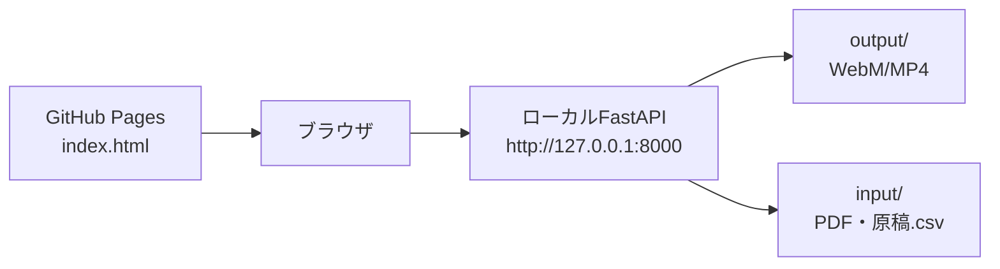

# デプロイガイド (GitHub Pages + ローカルバックエンド)

**バージョン**: 1.0.0  
**日付**: 2026-01-05  
**リポジトリ**: https://github.com/J1921604/Slide-Voice-Maker

## アーキテクチャ概要
- フロントエンド: 静的 `index.html` を GitHub Pages で配信
- バックエンド: ローカル FastAPI (`src/server.py`)、音声生成と動画合成を担当
- 通信: ブラウザから `http://127.0.0.1:8000` へアクセス（CORS不要の同一オリジンを推奨）



## GitHub Pages デプロイ手順
1. `main` ブランチへ push すると `Deploy GitHub Pages` ワークフローが実行されます。
2. ワークフローは `index.html`, `docs/`, `specs/`, `README.md` を `dist/` にコピーし、Pagesへ公開します。
3. 公開URLは Actions 実行ログの `page_url` を参照してください。

### 事前に必要なGitHub側設定（重要）
GitHub Actions を使って Pages にデプロイする場合、リポジトリ側の設定が原因で「ワークフローが1度も動かない」ことがあります。以下を**必ず**確認してください。

#### ⚠️ 最重要：Actionsが有効化されているか
**症状**: ワークフローファイル（`.github/workflows/*.yml`）が存在するのに、Actionsタブで「0 workflow runs」のまま

**原因と解決方法**:
1. リポジトリ → **Settings** → **Actions** → **General**
2. **Actions permissions** セクションで以下を確認：
   - ❌ **Disable actions**: これが選択されていると一切実行されません
   - ✅ **Allow all actions and reusable workflows** または **Allow ... actions** を選択
3. 設定後、`main` ブランチに空コミットをpushしてトリガー：
   ```bash
   git commit --allow-empty -m "ci: trigger workflow"
   git push origin main
   ```

#### Workflow permissions（Pagesデプロイ時のみ）
- 同じ画面下部の **Workflow permissions**
- **Read repository contents and packages permissions** (デフォルト) で動作します
- ワークフロー内で `permissions:` を明示指定している場合、この設定は上書きされます

#### Pages の Source が GitHub Actions
- リポジトリ → **Settings** → **Pages**
- **Build and deployment** → **Source**: **GitHub Actions**
### 手動でdistを用意する場合
```bash
mkdir -p dist
cp index.html dist/
cp -r docs dist/docs
cp -r specs dist/specs
cp README.md dist/README.md
```
作成したdistを `actions/upload-pages-artifact` でアップロードし、`actions/deploy-pages` で公開します。

### 手動トリガー
- GitHub Actions 画面で `Deploy GitHub Pages` を選択し、`Run workflow` をクリック。

### トラブルシュート：ワークフローが実行されない（0 runs のまま）
最も多い原因は **Actions が無効化されている** ことです。以下の順で確認してください。

#### 1. Actions が有効か（最重要）
- **Settings** → **Actions** → **General** → **Actions permissions**
- 「Disable actions」になっていると一切実行されません
- 「Allow all actions」または「Allow ... actions」に変更してください

#### 2. ワークフローが main ブランチに存在するか
- `.github/workflows/pages.yml` が `main` ブランチに commit されていること
- リモートリポジトリで確認：https://github.com/J1921604/Slide-Voice-Maker/blob/main/.github/workflows/pages.yml

#### 3. 実行トリガー条件が合っているか
- このワークフローは `on: push` (branches: main) と `workflow_dispatch` に対応
- main への push、または Actions 画面からの手動実行で起動します

#### 4. Organization 配下の場合
- Org の Actions ポリシーで制限されていないか確認
- Settings → Actions → General で Org レベルの設定を確認

#### 5. 診断用の検証方法
上記すべて確認しても動かない場合、超シンプルなテストワークフローで切り分け：
```yaml
# .github/workflows/test.yml
name: Test
on: [push, workflow_dispatch]
jobs:
  test:
    runs-on: ubuntu-latest
    steps:
      - run: echo "Actions is working!"
```
これでも実行されない場合、100% Actions が無効化されています。
## ローカルバックエンド起動

### 前提条件
- Python 3.13.7インストール済み
- 音声サンプル（任意）: 使用するTTSに応じて、サンプル音声が必要な場合があります。詳細は利用するTTSのドキュメントを参照してください。

### ワンクリック（推奨）
```powershell
powershell -ExecutionPolicy Bypass -File start.ps1
```
- ポート8000を解放し、仮想環境を自動作成/起動、依存パッケージをインストール、FastAPIを起動してブラウザで `index.html` を開きます。
- **初回起動時**: 音声合成モデルの初回ロードに時間がかかる場合があります（数秒〜数十秒）。

### 手動起動
```powershell
py -m uvicorn src.server:app --host 127.0.0.1 --port 8000
start http://127.0.0.1:8000/index.html
```

## 動作手順（フロントエンド）
1. ヘッダー左の **PDF入力** でPDFを選択（input/に保存され、スライド展開されます）
2. **原稿CSV入力** でCSVを読み込み、毎回 `input/原稿.csv` に上書き保存
3. 解像度・男声/女声・字幕ON/OFF・動画形式(WebM/MP4)を選択
4. **画像・音声生成** で `output/temp` をクリアしつつ素材を再生成
5. **動画生成** で `output/<PDF名>.webm|mp4` を上書き生成（字幕ONならASS焼き込み）
6. **動画出力** で output フォルダ内の動画をダウンロード
7. **PPTX出力** や **原稿CSV出力** も利用可能

## 環境変数（性能/画質チューニング）
| 変数 | 既定値 | 説明 |
|---|---|---|
| USE_VP8 | 1 | `1`でVP8高速、`0`でVP9高品質 |
| VP9_CPU_USED | 8 | VP9速度パラメータ (0-8) |
| VP9_CRF | 40 | VP9品質（大きいほど軽量） |
| OUTPUT_FPS | 30 | 出力FPS（字幕切替のため30fps推奨） |
| OUTPUT_MAX_WIDTH | 1280 | 出力最大幅（px） |
| SLIDE_RENDER_SCALE | 1.5 | PDF→画像のスケール |
| SILENCE_SLIDE_DURATION | 5 | 原稿なしスライド秒数 |
| SUBTITLE_MARGIN_V | 10 | 字幕の縦マージン |
| SUBTITLE_ALIGNMENT | 2 | 字幕の配置(ASS Alignment) |

## よくある質問
- **Pages公開後にバックエンドが見つからない**: Pagesは静的配信のみです。ローカルでFastAPIを起動してください。
- **音声生成が「signal is aborted without reason」で失敗**: 音声合成モデルの初回ロードに時間がかかる場合があります。タイムアウトやモデルの準備状況を確認してください。
- **音声サンプルが見つからない**: 使用するTTSの要件に従ってサンプル音声を準備してください（必要に応じてTTSのドキュメントを参照）。
- **動画生成が遅い**: `USE_VP8=1`, `OUTPUT_MAX_WIDTH` を下げる, `OUTPUT_FPS` を下げると高速化します。
- **字幕が切り替わらない**: 句読点でチャンク分割し、最小セグメント幅0.15秒を確保するASSを生成しています。CSVの句読点を確認してください。FPSを30fpsにすることで改善します。

## リンク
- リポジトリ: https://github.com/J1921604/Slide-Voice-Maker
- 完全仕様書: https://github.com/J1921604/Slide-Voice-Maker/blob/main/docs/%E5%AE%8C%E5%85%A8%E4%BB%95%E6%A7%98%E6%9B%B8.md
- 仕様 (spec): https://github.com/J1921604/Slide-Voice-Maker/blob/main/specs/001-Slide-Voice-Maker/spec.md
- 計画 (plan): https://github.com/J1921604/Slide-Voice-Maker/blob/main/specs/001-Slide-Voice-Maker/plan.md
- タスク (tasks): https://github.com/J1921604/Slide-Voice-Maker/blob/main/specs/001-Slide-Voice-Maker/tasks.md
