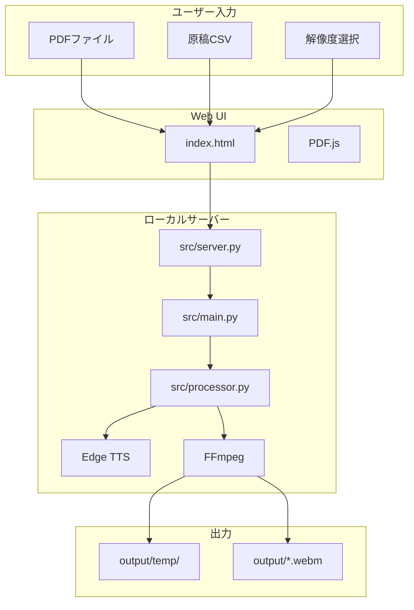
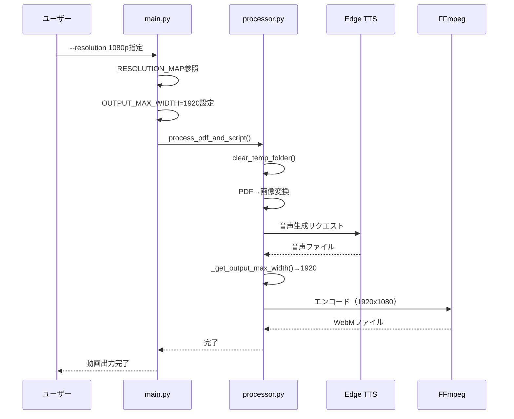
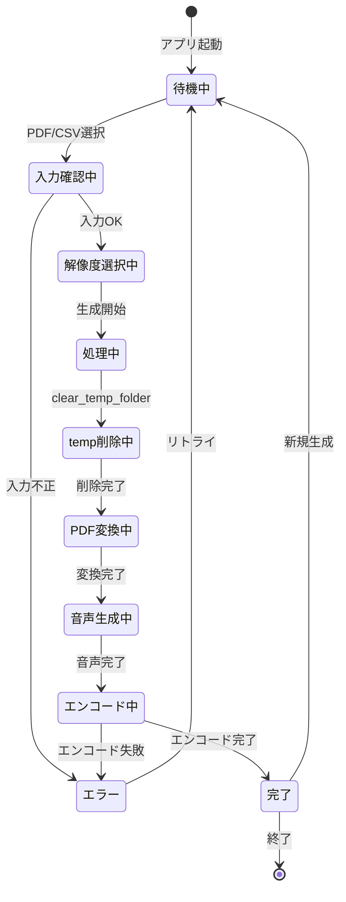
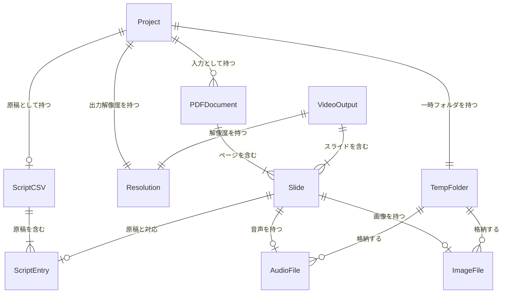

# Slide Voice Maker 完全仕様書

**バージョン**: 1.0.0
**日付**: 2026-01-05
**リポジトリ**: https://github.com/J1921604/Slide-Voice-Maker

---

## 目次

1. [概要](#概要)
2. [システムアーキテクチャ](#システムアーキテクチャ)
3. [機能仕様](#機能仕様)
4. [データモデル](#データモデル)
5. [CLI仕様](#cli仕様)
6. [Web UI仕様](#web-ui仕様)
7. [ファイル構造](#ファイル構造)
8. [テスト](#テスト)

---

## 概要

Slide Voice MakerはPDFスライドと原稿CSV（`index,script`形式）からAI音声ナレーション付き動画（WebM/MP4）を自動生成し、PPTXや原稿CSVとしても出力できるツールです。フロントエンドはGitHub Pagesで静的配信し、バックエンドはローカルFastAPIで動作します。

### 主要機能

| 機能 | 説明 | 優先度 |
|------|------|--------|
| 解像度選択 | 720p/1080p/1440pから選択可能 | P1 |
| temp上書き更新 | 毎回tempフォルダを自動クリア | P1 |
| CSV読み込み | UTF-8/Shift_JIS/EUC-JP対応 | P1 |
| 音声合成 | Edge TTSで実行 | P1 |
| WebM/MP4動画出力 | FFmpegでVP8/VP9/H.264を選択（WebM/MP4） | P1 |
| PPTX出力 | スライド画像をPPTXとしてダウンロード | P2 |

### 機能一覧（src/server.py起動時）

| 機能 | 説明 |
|------|------|
| PDF入力 | PDFファイルをアップロードしスライドとして展開 |
| 原稿CSV入力 | inputフォルダにCSVファイルを上書き保存 |
| 発音辞書 | word,alias形式のCSVで特定単語の読み方をテキスト置換（オプション） |
| 解像度選択 | 720p/1080p/1440pプルダウン（画像解像度） |
| 音声選択 | 画像・音声生成時の音声を4種類のプリセットから選択（実声はNanami/Keitaの2種を母体に、rate/pitch/volumeで聴感差を作る）。x1.5倍速デフォルト（rate +50%）、女声1 / 男声1。 |
| 再生速度選択 | 0.5x〜2.0x（全スライドに適用） |
| 字幕ON/OFF | 動画に字幕を埋め込むかどうかを選択 |
| 画像・音声生成 | Edge TTSでAI音声を生成、output/tempに画像・音声を保存 |
| 動画生成 | output/tempから動画WebM/MP4を生成（PDFと同名で保存） |
| 原稿CSV出力 | 編集した原稿をCSVでダウンロード |
| 動画出力 | outputフォルダから選択したWebM/MP4をダウンロード |
| PPTX出力 | スライド画像をPPTXとしてダウンロード |

### 動作環境

| 項目 | 要件 |
|------|------|
| OS | Windows 10/11 |
| Python | 3.10.11（推奨） |
| ブラウザ | Chrome / Edge（最新版） |

---

## システムアーキテクチャ

### 全体構成図



### データフロー



### 状態遷移



---

## 機能仕様

### FR-001: 解像度選択

| 選択肢 | 幅（px） | 高さ（px） | 環境変数値 |
|--------|----------|------------|------------|
| 720p   | 1280     | 720        | 1280       |
| 1080p  | 1920     | 1080       | 1920       |
| 1440p  | 2560     | 1440       | 2560       |

**実装**:

```python
RESOLUTION_MAP = {
    "720": 1280,
    "720p": 1280,
    "1080": 1920,
    "1080p": 1920,
    "1440": 2560,
    "1440p": 2560,
}
```

### FR-002: temp上書き機能

```python
def clear_temp_folder(temp_dir: str) -> None:
    """tempフォルダを上書きクリア"""
    if os.path.exists(temp_dir):
        try:
            shutil.rmtree(temp_dir)
            print(f"Cleared temp folder: {temp_dir}")
        except PermissionError as e:
            print(f"Warning: Could not clear temp folder: {e}")
    os.makedirs(temp_dir, exist_ok=True)
```

### FR-003: CSV読み込み（文字化け対処）

対応エンコーディング:
1. UTF-8
2. Shift_JIS
3. EUC-JP
4. ISO-2022-JP

**CSV形式**:

```csv
index,script
0,"最初のスライドの原稿テキスト"
1,"2番目のスライドの原稿（複数行可）"
```

### FR-003.5: 発音辞書（オプション）

**発音辞書形式**: word,alias形式のCSV

**CSV形式**:

```csv
word,alias
JERA,ジェラ
成果物,せいかぶつ
AI,エーアイ
```

**動作**:
- 音声生成時に原稿中の単語をテキスト置換
- Edge TTSに渡されるテキストは置換後のカタカナ・ひらがなになる
- Edge TTSがテキストを自動的にエスケープするため、SSMLタグは使用できない

**例**:

```
元のテキスト: "JERAの成果物を説明します。"
発音辞書適用後: "ジェラのせいかぶつを説明します。"
```

**保存先**: `input/発音辞書.csv`（Web UIからアップロード時）

### FR-004: 字幕生成（ASS形式）

**字幕フォーマット**: ASS（Advanced SubStation Alpha）

**字幕分割方式**:
- 句読点（。、！？!?\n）で分割
- 文字数比率でタイミングを計算

**字幕スタイル**:
- YouTube風の半透明グレー背景
- 太字白文字
- 下寄せ配置（スライド下部）

**最小セグメント時間**: 0.15秒（30fpsで約4.5フレーム、字幕切り替わりを確実にする）

**環境変数設定**:

| 変数名 | デフォルト | 説明 |
|--------|-----------|------|
| `SUBTITLE_MARGIN_V` | `10` | 字幕の縦マージン（下寄せ調整） |
| `SUBTITLE_ALIGNMENT` | `2` | 字幕配置（2=bottom-center） |

### FR-005: 動画エンコード最適化

**FPS設定**: 30fps（字幕切り替わり確保のため）

**スレッド数**: 全CPUコア活用（従来は最大8コアに制限）

**コーデック選択**:
- WebM: VP8（デフォルト、高速）/ VP9（高品質）
- MP4: H.264/AAC

**環境変数設定**:

| 変数名 | デフォルト | 説明 |
|--------|-----------|------|
| `OUTPUT_FPS` | `30` | 出力FPS |
| `USE_VP8` | `1` | VP8使用（高速）。`0`でVP9（高品質）。 |
| `VP9_CPU_USED` | `8` | エンコード速度（0-8、大きいほど高速） |
| `VP9_CRF` | `40` | 品質（大きいほど低品質・高速） |

---

## データモデル

### エンティティ関係図



### エンティティ定義

#### Resolution

| 属性 | 型 | 説明 |
|------|-----|------|
| value | string | "720p", "1080p", "1440p" |
| width | int | 1280, 1920, 2560 |
| height | int | 720, 1080, 1440 |

#### Slide

| 属性 | 型 | 説明 |
|------|-----|------|
| page_index | int | ページ番号（0始まり） |
| image_path | string | 画像ファイルパス |
| audio_path | string | 音声ファイルパス |
| script_text | string | 原稿テキスト |
| duration | float | 表示時間（秒） |

---

## CLI仕様

### 基本構文

```bash
py src/main.py [オプション]
```

### 引数定義

| 引数 | 型 | デフォルト | 説明 |
|------|-----|-----------|------|
| `--input` | string | `input/` | 入力ディレクトリパス |
| `--output` | string | `output/` | 出力ディレクトリパス |
| `--script` | string | `input/原稿.csv` | 原稿CSVファイルパス |
| `--resolution` | string | `720` | 出力解像度 |

### 使用例

```bash
# デフォルト設定
py src/main.py

# 1080p出力
py src/main.py --resolution 1080p

# フルオプション
py src/main.py --input ./input --output ./output --script ./input/原稿.csv --resolution 1440p
```

### 終了コード

| コード | 意味 |
|--------|------|
| 0 | 正常終了 |
| 1 | 入力ファイルエラー |
| 2 | 処理エラー |

---

## Web UI仕様

### 概要

ローカルサーバー（src/server.py）と連携し、ブラウザからPDF→WebM動画生成を実行。

### 技術スタック

| 項目 | 技術 |
|------|------|
| UIフレームワーク | React 18（CDN） |
| JSXトランスパイル | Babel（CDN） |
| スタイリング | Tailwind CSS（CDN） |
| PDF表示 | PDF.js 3.11 |
| アイコン | Lucide（インライン） |

### 解像度設定

```javascript
const RESOLUTION_OPTIONS = [
    { label: '720p (1280x720)', value: '720p', width: 1280, height: 720 },
    { label: '1080p (1920x1080)', value: '1080p', width: 1920, height: 1080 },
    { label: '1440p (2560x1440)', value: '1440p', width: 2560, height: 1440 },
];
```

### 主要機能

1. **PDF読み込み**: PDF.jsでプレビュー表示、サーバーにアップロード保存
2. **CSV読み込み**: 複数エンコーディング対応パーサー、サーバーにアップロード保存
3. **音声生成**: サーバー経由でEdge TTS実行
    - `voice_gender`: `male` / `female` を指定可能（既定: `female`）
4. **動画出力**: サーバーでFFmpegエンコード（WebM/VP8）
5. **ダウンロード**: サーバーのoutputフォルダからWebMをダウンロード

---

## ファイル構造

```
Slide-Voice-Maker/
├── index.html              # Webアプリ（サーバー連携）
├── start.ps1               # ワンクリック起動スクリプト
├── README.md               # プロジェクト説明
├── requirements.txt        # Python依存パッケージ
├── preview.bat             # プレビュー起動
├── pytest.ini              # pytestの設定
│
├── input/
│   ├── *.pdf               # 入力PDFファイル
│   └── 原稿.csv            # ナレーション原稿
│
├── output/
│   ├── *.webm              # 生成された動画
│   └── temp/               # 一時ファイル（自動クリア）
│
├── src/
│   ├── main.py             # CLIエントリポイント
│   ├── processor.py        # PDF処理・動画生成
│   └── server.py           # FastAPIサーバー
│
├── specs/
│   └── 001-Slide-Voice-Maker/
│       ├── spec.md         # 機能仕様書
│       ├── plan.md         # 実装計画
│       ├── tasks.md        # タスク一覧
│       ├── research.md     # 調査結果
│       ├── data-model.md   # データモデル
│       ├── quickstart.md   # クイックスタート
│       └── contracts/      # API契約
│
├── docs/
│   ├── 完全仕様書.md       # 本ファイル
│   └── ...
│
└── tests/
    └── e2e/                # E2Eテスト
```

---

## テスト

### ローカルE2Eテスト

```bash
# pytest E2E
py -m pytest tests/e2e/ -v
```

### 成功基準

| ID | 基準 | 測定方法 |
|----|------|----------|
| SC-001 | スライド1枚あたり10秒以内 | 処理時間計測 |
| SC-002 | 選択解像度と出力解像度100%一致 | FFprobe検証 |
| SC-003 | tempフォルダが毎回クリアされる | ファイル確認 |
| SC-004 | CSV読み込みで文字化けしない | 日本語確認 |

---

## 関連リンク

- **リポジトリ**: https://github.com/J1921604/Slide-Voice-Maker
- **機能仕様書**: https://github.com/J1921604/Slide-Voice-Maker/blob/main/specs/001-Slide-Voice-Maker/spec.md
- **実装計画**: https://github.com/J1921604/Slide-Voice-Maker/blob/main/specs/001-Slide-Voice-Maker/plan.md
- **タスク一覧**: https://github.com/J1921604/Slide-Voice-Maker/blob/main/specs/001-Slide-Voice-Maker/tasks.md
- **クイックスタート**: https://github.com/J1921604/Slide-Voice-Maker/blob/main/specs/001-Slide-Voice-Maker/quickstart.md
