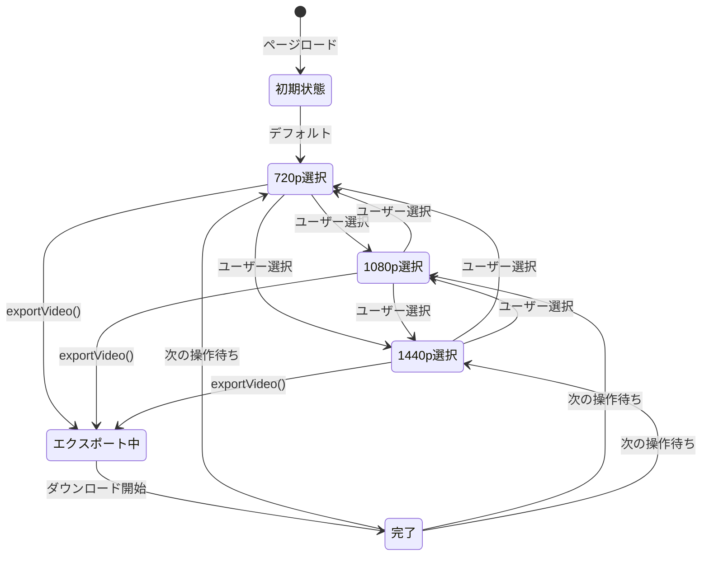

# Web API契約: Slide Voice Maker

**日付**: 2026-01-05
**対象**: index.html（サーバー連携）

## 概要

Web UIはFastAPIサーバー（src/server.py）と連携して動作する。以下はJavaScript内部のインターフェースとサーバーAPIの定義である。

## 解像度設定インターフェース

### RESOLUTION_OPTIONS

```javascript
const RESOLUTION_OPTIONS = [
    { label: '720p (1280x720)', value: '720p', width: 1280, height: 720 },
    { label: '1080p (1920x1080)', value: '1080p', width: 1920, height: 1080 },
    { label: '1440p (2560x1440)', value: '1440p', width: 2560, height: 1440 },
];
```

### ResolutionOption型

| プロパティ | 型 | 説明 |
|------------|-----|------|
| label | string | UI表示用ラベル |
| value | string | 内部識別値 |
| width | number | 出力幅（px） |
| height | number | 出力高さ（px） |

## React State

### selectedResolution

```javascript
const [selectedResolution, setSelectedResolution] = useState('720p');
```

| プロパティ | 型 | デフォルト | 説明 |
|------------|-----|-----------|------|
| selectedResolution | string | '720p' | 現在選択中の解像度 |

## 関数インターフェース

### getResolutionDimensions()

選択中の解像度に対応する幅・高さを取得する。

**シグネチャ**:

```javascript
const getResolutionDimensions = () => {
    const res = RESOLUTION_OPTIONS.find(r => r.value === selectedResolution);
    return res || RESOLUTION_OPTIONS[0];
};
```

**戻り値**:

| プロパティ | 型 | 説明 |
|------------|-----|------|
| label | string | UI表示用ラベル |
| value | string | 内部識別値 |
| width | number | 出力幅（px） |
| height | number | 出力高さ（px） |

### exportVideo()

動画をエクスポートする。

**シグネチャ**:

```javascript
const exportVideo = async () => { ... }
```

**動作**:

1. `getResolutionDimensions()` で解像度取得
2. canvasサイズを設定
3. MediaRecorderで録画
4. WebM/MP4ファイルとしてダウンロード

## UIコンポーネント

### 解像度選択ドロップダウン

```jsx
<select
    value={selectedResolution}
    onChange={(e) => setSelectedResolution(e.target.value)}
    className="px-3 py-2 bg-slate-800 hover:bg-slate-700 text-white rounded-lg text-sm border border-white/10 cursor-pointer"
>
    {RESOLUTION_OPTIONS.map(opt => (
        <option key={opt.value} value={opt.value}>{opt.label}</option>
    ))}
</select>
```

## 状態遷移


