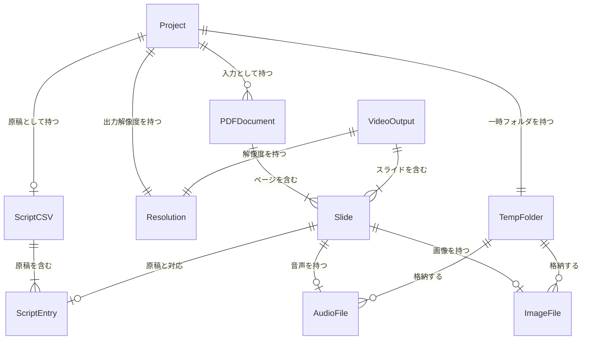
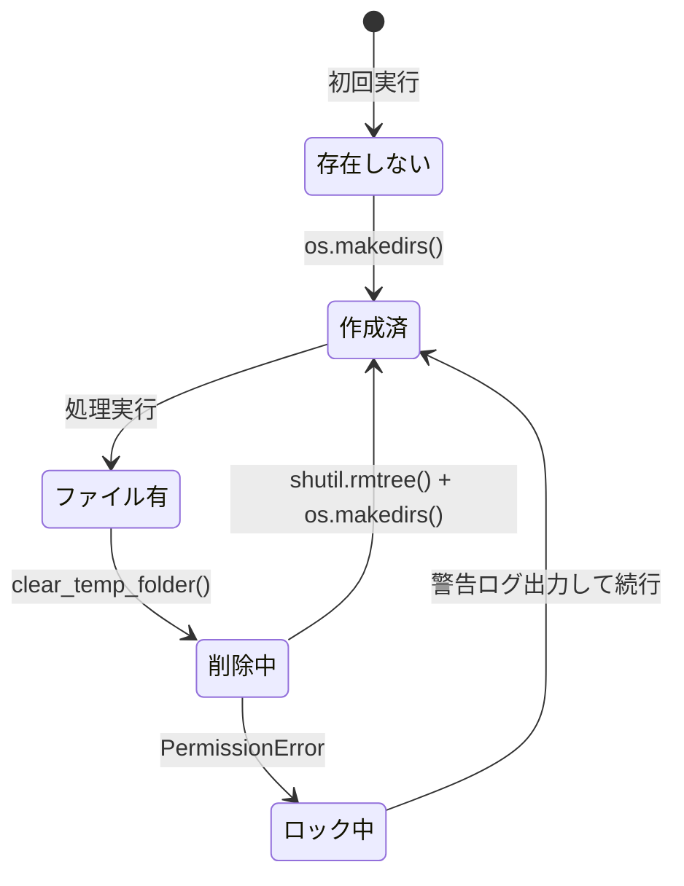
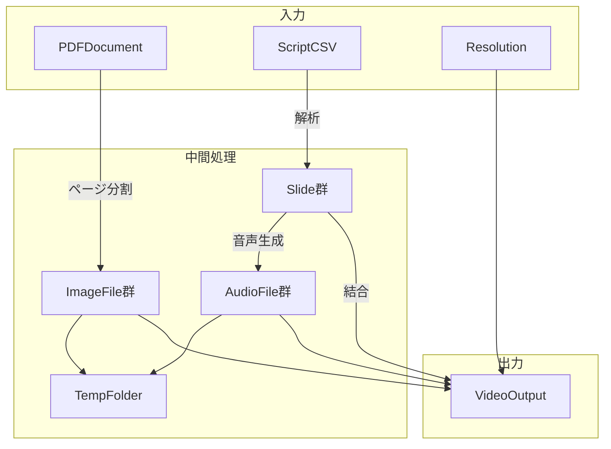

# データモデル: Slide Voice Maker

**日付**: 2026-01-05
**Phase**: 1 - 設計

## 概要

本ドキュメントは、Slide Voice Makerのデータモデルを定義する。

## エンティティ関係図



## エンティティ定義

### Resolution（解像度設定）

出力動画の解像度を定義する。

| 属性 | 型 | 説明 | 制約 |
|------|-----|------|------|
| value | string | 選択値 | "720p", "1080p", "1440p" のいずれか |
| width | int | 出力幅（px） | 1280, 1920, 2560 のいずれか |
| height | int | 出力高さ（px） | 720, 1080, 1440 のいずれか |
| label | string | 表示ラベル | 例: "720p (1280x720)" |

**解像度定義**:

```python
RESOLUTION_MAP = {
    "720": 1280,
    "720p": 1280,
    "1080": 1920,
    "1080p": 1920,
    "1440": 2560,
    "1440p": 2560,
}
```

---

### TempFolder（一時フォルダ）

動画生成時の一時ファイルを格納するフォルダ。

| 属性 | 型 | 説明 | 制約 |
|------|-----|------|------|
| path | string | フォルダパス | output/temp/{PDF名}/ |
| auto_clear_on_start | bool | 開始時自動クリア | 常にTrue |

**状態遷移**:



---

### Slide（スライド）

PDFの1ページに対応するスライドデータ。

| 属性 | 型 | 説明 | 制約 |
|------|-----|------|------|
| page_index | int | ページ番号（0始まり） | 0以上 |
| image_path | string | 画像ファイルパス | temp/{PDF名}/slide_{index}.png |
| audio_path | string | 音声ファイルパス | temp/{PDF名}/audio_{index}.wav |
| script_text | string | 原稿テキスト | UTF-8 |
| duration | float | 表示時間（秒） | 0より大きい |

**Pythonデータクラス**:

```python
@dataclass
class _SlideItem:
    page_index: int
    image_path: str
    audio_path: str
    script_text: str
    duration: float
```

---

### VideoOutput（動画出力）

生成される動画ファイル。

| 属性 | 型 | 説明 | 制約 |
|------|-----|------|------|
| filename | string | 出力ファイル名 | {PDF名}.webm or {PDF名}.mp4 |
| resolution | Resolution | 解像度設定 | 720p/1080p/1440p |
| codec | string | 動画コーデック | VP8 または VP9 |
| duration | float | 動画長（秒） | 全スライドの合計 |
| file_path | string | 出力パス | output/{filename} |

---

### ScriptEntry（原稿エントリ）

CSVの1行に対応する原稿データ。

| 属性 | 型 | 説明 | 制約 |
|------|-----|------|------|
| index | int | スライド番号 | 0始まり |
| script | string | 読み上げテキスト | UTF-8、空文字可 |

**CSV形式**:

```csv
index,script
0,"最初のスライドの原稿テキスト"
1,"2番目のスライドの原稿"
```

---

## 処理フロー



## バリデーションルール

### 解像度バリデーション

```python
def validate_resolution(value: str) -> str:
    """無効な解像度値をデフォルト720pにフォールバック"""
    valid_values = ["720", "720p", "1080", "1080p", "1440", "1440p"]
    if value not in valid_values:
        print(f"Warning: Invalid resolution '{value}', using default 720p")
        return "720"
    return value
```

### ページインデックスバリデーション

```python
def validate_page_index(index: int, max_pages: int) -> bool:
    """ページ番号が有効範囲内か確認"""
    return 0 <= index < max_pages
```

### 原稿テキストバリデーション

```python
def validate_script_text(text: str) -> str:
    """空文字や空白のみの場合は空文字を返す"""
    if text is None:
        return ""
    return text.strip()
```
