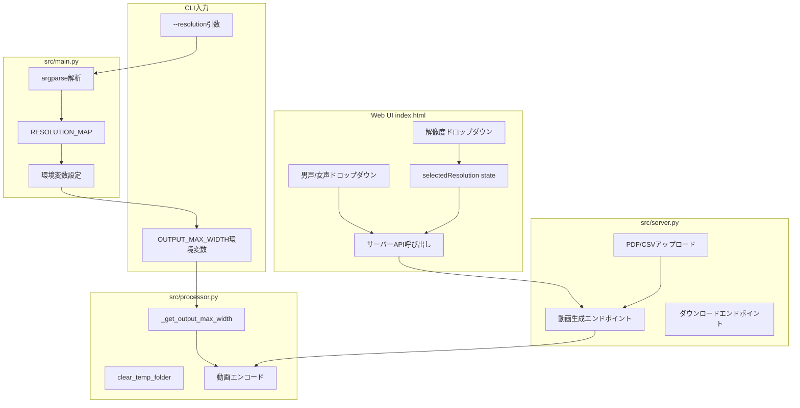
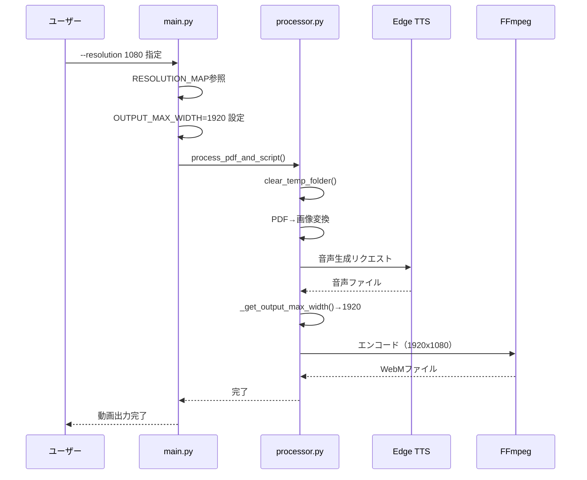
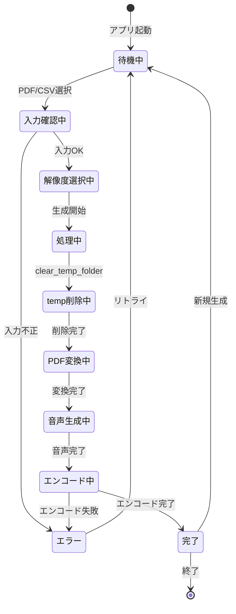

# 実装計画: Slide Voice Maker

**ブランチ**: `001-Slide-Voice-Maker`
**日付**: 2026-01-05
**仕様**: https://github.com/J1921604/Slide-Voice-Maker/blob/main/specs/001-Slide-Voice-Maker/spec.md

## 概要

本計画は、Slide Voice Makerツールに以下の機能を追加するための実装計画である:

1. **出力動画の解像度選択機能**: 720p/1080p/1440pから選択可能
2. **temp上書き更新機能**: 毎回のビルド時にtempフォルダをクリア
3. **字幕ON/OFF機能**: 動画に字幕を埋め込むかどうかを選択可能（句読点分割+文字数比率）
4. **動画形式選択**: WebM/MP4を選択可能
5. **PPTX出力**: ブラウザ上のスライドをPPTXとして出力
6. **男声/女声選択**: 画像・音声生成時の話者を選択可能（既定: 女声）

加えて、運用上の要件として以下も満たす:

- PDFアップロードでinput/に保存、原稿CSV入力でinput/原稿.csv上書き、音声生成でEdge TTS実行、output/にWebM/MP4出力
- **Web UIはサーバー連携のみ（静的配信はGitHub Pages、APIはローカル）**
- **ホーム画面ヘッダーでPDFを常時アップロード**
- **PDFアップロード後の画面では原稿CSV入力を維持**（文字化け対処のため）
- **動画形式（WebM/MP4）とPPTX出力を提供**
- 変更内容を **E2Eテストへ反映**し、検証可能にする

## 技術コンテキスト

**言語/バージョン**: Python 3.13.7
**主要依存関係**: edge-tts, moviepy<2.0, pymupdf, pandas, imageio-ffmpeg, fastapi, uvicorn
**ストレージ**: ファイルシステム（output/, output/temp/）
**テスト**: 手動テスト + E2Eスクリプト
**ターゲットプラットフォーム**: Windows
**プロジェクト種別**: single（Python CLI + Web UI）
**パフォーマンス目標**: スライド1枚あたり10秒以内で動画生成
**制約**: UTF-8エンコーディング必須、メモリ使用量はPDFサイズの5倍以内
**規模/スコープ**: 個人/小規模チーム向け、1～100ページのPDF対応

## 憲法チェック

| 原則 | 確認項目 | 状態 |
|------|----------|------|
| I. テスト駆動開発 | テスト作成計画が含まれているか | ✅ |
| II. セキュリティ最優先 | セキュリティ要件が機能要件より優先されているか | ✅ |
| III. パフォーマンス基準 | 定量的なパフォーマンス目標が定義されているか | ✅ |
| IV. 品質と一貫性 | UTF-8エンコーディング、依存バージョン固定が確認されているか | ✅ |
| V. シンプルさの追求 | YAGNI原則に従い、複雑さの正当化が必要か | ✅ |

**制約確認**:

- [x] 機密データの平文保存がないこと
- [x] 外部依存がバージョン固定されていること
- [x] 仕様と実装の乖離がレビューで検知可能であること

## プロジェクト構造

### ドキュメント（本機能）

```text
specs/001-Slide-Voice-Maker/
├── spec.md              # 機能仕様書
├── plan.md              # 本ファイル（実装計画）
├── tasks.md             # タスク一覧
├── research.md          # 調査結果（Phase 0出力）
├── data-model.md        # データモデル（Phase 1出力）
├── quickstart.md        # クイックスタート（Phase 1出力）
└── contracts/           # API契約（Phase 1出力）
```

### ソースコード（リポジトリルート）

```text
Slide-Voice-Maker/
├── index.html           # Web UI（サーバー連携、GitHub Pages静的配信）
├── start.ps1            # ワンクリック起動スクリプト
├── requirements.txt     # Python依存パッケージ
├── preview.bat          # プレビュー起動
├── input/
│   ├── *.pdf            # 入力PDFファイル
│   └── 原稿.csv         # ナレーション原稿
├── output/
│   ├── *.webm / *.mp4   # 生成された動画
│   └── temp/            # 一時ファイル（自動クリア対象）
├── src/
│   ├── main.py          # CLIエントリポイント
│   ├── processor.py     # PDF処理・動画生成
│   └── server.py        # FastAPIサーバー
└── tests/
    └── e2e/
        ├── test_resolution.py      # CLI解像度E2Eテスト
        └── test_local_backend.py   # バックエンドE2Eテスト

pytest.ini               # pytest設定（markers等）
```

## 実装アーキテクチャ



## データフロー



## 状態遷移



## 複雑さの追跡

本実装は既存コードへの最小限の変更で実現するため、追加の複雑さはない。

| 項目 | 判定 |
|------|------|
| 新規パターン導入 | なし |
| 外部依存追加 | なし（shutil標準ライブラリのみ） |
| アーキテクチャ変更 | なし |

## Phase 0: 調査

### 解決済み事項

| 項目 | 決定 | 根拠 |
|------|------|------|
| 解像度指定方式 | 環境変数OUTPUT_MAX_WIDTH | 既存実装との互換性維持 |
| temp削除方式 | shutil.rmtree() | 標準ライブラリで信頼性高い |
| UI解像度 | React state + select要素 | 既存UIパターンに合致 |

### 調査結果

- 解像度はアスペクト比16:9を維持（720p=1280x720, 1080p=1920x1080, 1440p=2560x1440）
- VP8/VP9エンコードは解像度に応じて自動スケーリング
- tempフォルダはPDF名ごとにサブフォルダを作成

## Phase 1: 設計

### 解像度選択機能

**Python版（src/main.py）**:
- `--resolution` 引数追加（720/720p/1080/1080p/1440/1440p）
- `RESOLUTION_MAP` で引数値を環境変数値に変換
- `os.environ["OUTPUT_MAX_WIDTH"]` に設定

**Web UI（index.html）**:
- `selectedResolution` state追加（デフォルト: '720p'）
- `RESOLUTION_OPTIONS` 配列で選択肢定義
- サーバーAPIに解像度パラメータを送信

### temp上書き機能

**src/processor.py**:
- `clear_temp_folder(temp_dir)` 関数追加
- `shutil.rmtree()` でフォルダ削除
- `os.makedirs()` で再作成
- ファイルロック時のエラーハンドリング

## Phase 2: 実装

タスク詳細は https://github.com/J1921604/Slide-Voice-Maker/blob/main/specs/001-Slide-Voice-Maker/tasks.md を参照。

## 検証計画

| テスト種別 | 内容 | 担当 |
|------------|------|------|
| 単体テスト | clear_temp_folder()の動作確認 | 自動 |
| CLI E2Eテスト | --resolution 1080で動画生成 | 自動 |
| バックエンドE2Eテスト | サーバー経由でPDF/CSV→WebM生成 | 自動 |
| 回帰テスト | 既存機能（デフォルト設定）の動作確認 | 手動 |

## リスクと対策

| リスク | 影響度 | 対策 |
|--------|--------|------|
| 高解像度でメモリ不足 | 中 | 1440p使用時の警告表示 |
| tempファイルロック | 低 | エラーログ出力して続行 |
| ブラウザ互換性 | 低 | Chrome/Edge最新版を推奨 |
